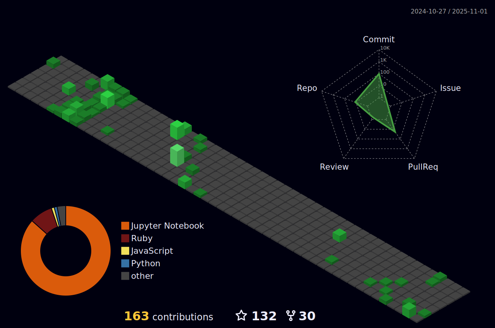

<h1 align="center">Hi 👋, I'm Yunus Ali</h1>
<h3 align="center">A passionate Software Engineer</h3>

🌱 I’m currently learning **Ruby on rails, Nodejs , Java, TypeScript**

💬 Ask me about **Html,CSS,React,Javascript,Flutter**

📫 How to reach me **aliyunus291@gmail.com**

<h3>Connect with me:</h3>

[![Twitter][1.2]][1] [![LinkedIn][2.2]][2] [![Instagram][3.2]][3] [![Telegram][4.2]][4]

[1.2]: https://s4.uupload.ir/files/twitter_prkb.png
[2.2]: https://s4.uupload.ir/files/linkedin_amwn.png
[3.2]: https://s4.uupload.ir/files/instagram_6djz.png
[4.2]: https://s4.uupload.ir/files/telegram_q47u.png

[1]: https://twitter.com/iamyunusali
[2]: https://www.linkedin.com/in/iamyunusali/
[3]: https://www.instagram.com/iamyunusali
[4]: https://telegram.me/iamyunus

<h3>Languages and Tools</h3>

  

  

  

  

## 📈 Github Stats

 
 

<b>Visitor's Count</b>

